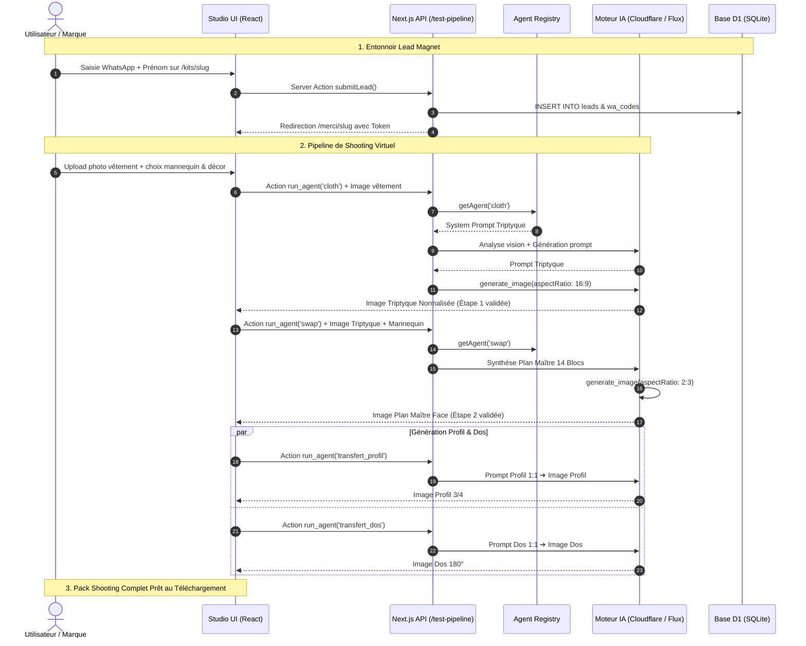

# 📖 Documentation Complète — FashionAI (FashionAI.agency)

> **FashionAI** est un écosystème e-commerce mode & intelligence artificielle combinant un **entonnoir d'acquisition par lead magnet** et un **Studio de shooting virtuel IA multi-agents haute fidélité**.

---

## 📑 Sommaire
1. [Vue d'Ensemble du Projet](#1-vue-densemble-du-projet)
2. [Architecture Technique & Stack](#2-architecture-technique--stack)
3. [Module 1 : Acquisition & Lead Magnet (`/kits`)](#3-module-1--acquisition--lead-magnet-kits)
4. [Module 2 : Studio de Shooting Virtuel (`/studio`)](#4-module-2--studio-de-shooting-virtuel-studio)
5. [Pipeline Multi-Agents & Prompts Détaillés](#5-pipeline-multi-agents--prompts-détaillés)
   - [Agent 1 : `cloth` (Ghost Mannequin Director)](#agent-1--cloth--ghost-mannequin-director)
   - [Agent 2 : `swap` (Studio Swap Director)](#agent-2--swap--studio-swap-director)
   - [Agent 3 : `transfert_profil` (Vue 3/4 Profil)](#agent-3--transfert_profil--vue-34-profil)
   - [Agent 4 : `transfert_dos` (Vue de Dos 180°)](#agent-4--transfert_dos--vue-de-dos-180)
6. [Base de Données & Modèle Relationnel (`schema.sql`)](#6-base-de-données--modèle-relationnel-schemasql)
7. [Flux de Données & Cycle de Vie d'une Requête](#7-flux-de-données--cycle-de-vie-dune-requête)

---

## 1. Vue d'Ensemble du Projet

L'application répond à une problématique centrale dans l'industrie de la mode : **le coût élevé et la complexité logistique des shootings photos traditionnels**.

Elle propose deux volets interconnectés :
1. **Acquisition B2B** : Des kits de formation et des ressources gratuites/payantes distribuées via des landing pages spécialisées pour capturer des prospects qualifiés (numéro WhatsApp & email).
2. **Plateforme SaaS Studio** : Un studio de création visuelle automatisé permettant aux marques d'importer une simple photo de vêtement et d'obtenir un pack shooting e-commerce complet (Vue Face, Profil 3/4, Dos) avec cohérence anatomique et textile garantie.

---

## 2. Architecture Technique & Stack

| Composant | Technologie | Rôle & Description |
| :--- | :--- | :--- |
| **Framework Web** | Next.js (App Router) | Rendu SSR/CSR, routage dynamique, API Routes et Server Actions. |
| **Styling & UI** | TailwindCSS & CSS natif | Thème luxe/éditorial noir & blanc, typographie Geist, micro-animations (`motion.css`). |
| **Base de Données** | Cloudflare D1 (SQLite Edge) | Stockage serverless ultra-rapide des leads et codes WhatsApp. |
| **Validation** | Zod & libphonenumber-js | Contrôle des données et normalisation des numéros de téléphone au format E.164. |
| **Moteur Multi-Agents** | Directives Markdown (`agents/*.md`) | Prompts d'analyse et de direction artistique versionnés (`src/lib/agents/registry.ts`). |
| **Génération IA** | Cloudflare Workers AI / Fal.ai / Flux | Vision par ordinateur, synthèse de prompt et rendu photoréaliste. |

---

## 3. Module 1 : Acquisition & Lead Magnet (`/kits`)

### Parcours Utilisateur
1. **Landing Page Dynamique (`/kits/[slug]`)** :
   - Présentation de la valeur du kit (ex. *« Transformez vos photos de collection en films de campagne »*).
   - Encart des prérequis techniques (ex. *Google Veo 3*, coût estimé, niveau requis).
   - Présentation du pack : Kit Markdown `.md`, guide PDF opérationnel, tutoriel vidéo de 12 min.
2. **Formulaire de Capture (`KitForm.tsx`)** :
   - Saisie du prénom, de l'email (optionnel) et du numéro WhatsApp.
   - La Server Action `submitLead` valide l'indicatif international via `libphonenumber-js` et insère le prospect dans Cloudflare D1.
3. **Page de Confirmation (`/merci/[slug]`)** :
   - Délivrance du lien de téléchargement et invitation à rejoindre le groupe d'échange WhatsApp.

---

## 4. Module 2 : Studio de Shooting Virtuel (`/studio`)

Le studio permet de créer une collection photo e-commerce complète en 3 étapes :

```
┌─────────────────────────────────────────────────────────────┐
│ 1. UPLOAD DU VÊTEMENT (Cintre / À plat / Porté)              │
└──────────────────────────────┬──────────────────────────────┘
                               ▼
┌─────────────────────────────────────────────────────────────┐
│ ÉTAPE 1 : Normalisation Triptyque (Agent CLOTH)             │
│ ➔ Produit l'image triptyque (Stylisé + Ghost Face + Dos)    │
└──────────────────────────────┬──────────────────────────────┘
                               ▼
┌─────────────────────────────────────────────────────────────┐
│ ÉTAPE 2 : Composition Plan Maître Face (Agent SWAP)         │
│ ➔ Choix du mannequin (ex: Fatou) & Décor (ex: Cyclorama)   │
│ ➔ Génère le Plan Maître 2:3                                 │
└──────────────────────────────┬──────────────────────────────┘
                               ▼
┌─────────────────────────────────────────────────────────────┐
│ ÉTAPE 3 : Multi-Angles & Cohérence                          │
│ ➔ Agent TRANSFERT_PROFIL  (Vue 3/4 profil 1:1)              │
│ ➔ Agent TRANSFERT_DOS     (Vue dos 180° 1:1)                │
└──────────────────────────────┬──────────────────────────────┘
                               ▼
┌─────────────────────────────────────────────────────────────┐
│ ESPACE DE LIVRAISON : Téléchargement du Pack Shooting HD    │
└─────────────────────────────────────────────────────────────┘
```

---

## 5. Pipeline Multi-Agents & Prompts Détaillés

Le cœur d'intelligence repose sur **4 agents spécialisés** fonctionnant en cascade.

---

### Agent 1 : `cloth` — Ghost Mannequin Director
* **Rôle** : Directeur artistique en photographie produit. Analyse la tenue uploadée et génère un prompt triptyque normalisé sur fond blanc pur (Ratio 16:9).
* **Entrées** : Photos du vêtement + option `@precisions` (indications matière, zip dos, modifications).

#### 📐 Structure des 3 Panneaux générés :
* **Panneau 1 (Gauche, ~25% largeur)** : Mannequin stylisé noir mat sans visage en pied, montrant comment la tenue complète et les accessoires se portent en volume.
* **Panneau 2 (Centre, ~37.5% largeur)** : Ghost mannequin vue de **FACE** (silhouette invisible en creux, texture, col, tombé).
* **Panneau 3 (Droite, ~37.5% largeur)** : Ghost mannequin vue de **DOS** (silhouette invisible dos, zip dorsal, pinces).

#### 📝 Structure du Prompt Produit :
```text
Ultra-realistic professional fashion product photography triptych of [description globale de la tenue], three panels arranged left to right on a single seamless pure white background, shot with the same studio lighting setup for perfect visual consistency across all panels. Panel 1 occupies roughly one quarter of the total image width; Panels 2 and 3 each occupy roughly three-eighths of the width, giving the front and back garment views generous scale. Photographed like genuine product photography — realistic fabric weight, drape, weave and seam detail throughout, no CGI look, no plastic sheen, no illustration or render aesthetic.

═══ PANEL 1 (LEFT, narrower) — STYLIZED MANNEQUIN, FULL BODY FRONT VIEW ═══
[Silhouette masculine|féminine] stylized display mannequin, full body from head to feet, smooth matte black surface with a subtle organic crackled texture, ovoid completely featureless head (no eyes, nose, mouth, or ears rendered), fine articulated joint lines visible at shoulders, elbows, wrists, hips and knees, simplified matte black hands. 
Standing pose, weight evenly balanced, arms relaxed at the sides, camera at mid-chest height, full figure framed head to toe with tight even margins left and right.
The mannequin is genuinely wearing the complete look — same exact garment construction, colour and material as confirmed in Panels 2 and 3.
[Accessoires sélectionnés : chaussures, sac, bijoux...]

═══ PANEL 2 (CENTRE) — GHOST MANNEQUIN FRONT VIEW ═══
Invisible mannequin display, true hollow-body effect with the interior back of the garment realistically visible through the neck and openings.
─── PIECE 1 (TOP) ───
[Matière, texture, grammage apparent, tombé, couleur exacte HEX, motif, col, manches, boutons, surpiqûres]
─── PIECE 2 (BOTTOM) ───
[Coupe du bas, taille, poches, ourlet]

═══ PANEL 3 (RIGHT) — GHOST MANNEQUIN BACK VIEW ═══
Invisible mannequin display, back perspective, true hollow-body effect showing interior front neckline.
─── PIECE 1 (TOP BACK) ───
[Fermeture dorsale, pinces, découpes arrière, encolure dos]
─── PIECE 2 (BOTTOM BACK) ───
[Poches dos, coutures fessier, ourlet arrière]

Negative prompt (triptyque complet)
mannequin head on panels 2 or 3, human skin, face, hair, wooden joints, plastic gloss, 3D render, drawing, vector, watermark, shadow mismatch, cropped edges.
```

---

### Agent 2 : `swap` — Studio Swap Director
* **Rôle** : Directeur artistique, styliste et chef opérateur. Fusionne le vêtement de `@tenue` avec l'identité du mannequin sélectionné (`@perso`) et le décor choisi (`source`).
* **Format** : Prompt maître complet en **14 blocs** au ratio 2:3.

#### 📝 Structure des 14 Blocs d'Analyse et de Rendu :
```text
[Reference lock : @perso, @tenue si présents]

1. [Style et type d'image : Shoot éditorial haute couture, lookbook studio luxe, 85mm f/2.8]
2. [Morphologie réelle du sujet issu de @perso]
3. [Micro-textures de peau réalistes : pores, grain naturel, aucune retouche plastique]
4. [Identité complète : carnation, regard, bouche, coiffure et texture capillaire]
5. [Bijoux et accessoires assortis]
6. [Pose et attitude : posture naturelle, appui asymétrique, tombé naturel des bras]
7. [Description complète et exclusive du vêtement issu de @tenue (reprise fidèle sans réinvention)]
8. [Cadrage : Plan américain 2:3, hauteur de poitrine, respiration visuelle]
9. [Décor : Cyclorama studio blanc infini #FFFFFF avec contact shadow doux, ou scène architecturale]
10. [Éclairage studio : Boîte à lumière diffuse, fill light subtil, découpe douce sur les contours]
11. [Optique & Piqué : Focale 85mm portrait, piqué chirurgical sur le tissage du vêtement]
12. [Étalonnage & Rendu : Température 5600K, balance des blancs neutre, contraste maîtrisé]
13. [Palette couleur : 5 teintes dominantes avec équivalents hexadécimaux]
14. [Contrôle anatomique : Aucun membre supplémentaire, cohérence physique absolue]

Negative prompt
doll skin, airbrushed, cartoon, CGI, extra limbs, deformed fingers, blurry fabric, inaccurate clothing, low resolution, bad anatomy.
```

---

### Agent 3 : `transfert_profil` — Vue 3/4 Profil
* **Rôle** : Photographe de transfert. Rejoue l'univers exact du Plan Maître validé dans un angle de **3/4 profil à 45°** (Ratio 1:1).
* **Règle de Déduction Latérale** : Déduit la ligne de couture de profil en faisant la jonction parfaite entre le panneau 2 (face) et le panneau 3 (dos) du triptyque, sans inventer d'éléments latéraux absents.

#### 📝 Spécifications du Cadrage Profil :
```text
[Reprise de l'identité mannequin, lumière, décor et étalonnage du Plan Maître]

CADRAGE & POSTURE 3/4 PROFIL :
- Échelle : Plan américain mi-cuisse, format carré 1:1.
- Orientation corps : 45 degrés par rapport à l'objectif.
- Posture : Appui fluide sur la jambe arrière, épaules ouvertes, bras dégagés du buste pour révéler la coupe de côté.
- Regard : Profil 3/4 posé et direct.
- Rendu vêtement : Projection réelle du volume (écartement du tissu), profondeur du drapé, silhouette continue de l'épaule à l'ourlet.
```

---

### Agent 4 : `transfert_dos` — Vue de Dos (180°)
* **Rôle** : Rejoue l'univers du shoot en prise de vue dorsale directe à **180°** (Ratio 1:1).
* **Règle d'Autorité Dorsale** : Le Panneau 3 du triptyque initial fait autorité absolue pour tout ce qui concerne le dos (fermeture éclair, pinces, décolleté dos).

#### 📝 Spécifications du Cadrage Dos :
```text
[Reprise de l'identité mannequin (coiffure vue de dos), lumière, décor et étalonnage]

CADRAGE & POSTURE DOS (180°) :
- Échelle : Du sommet du crâne jusqu'à mi-cuisse, format carré 1:1.
- Orientation corps : Dos complet tourné à 180° face au fond.
- Posture : Port altier, épaules droites, nuque dégagée, bras légèrement écartés.
- Rendu vêtement : Rendu conforme au Panneau 3 (position et type de zip, pinces dorsales, découpes arrière et tombé sur les reins).
- Mise en valeur : Lecture intégrale de la structure arrière sans aucune occlusion.
```

---

## 6. Base de Données & Modèle Relationnel (`schema.sql`)

La persistance repose sur **Cloudflare D1 (SQLite serverless)** :

```sql
DROP TABLE IF EXISTS leads;
DROP TABLE IF EXISTS wa_codes;

-- Table des prospects capturés
CREATE TABLE leads (
  id TEXT PRIMARY KEY,
  first_name TEXT NOT NULL,
  whatsapp TEXT NOT NULL UNIQUE,
  email TEXT,
  opt_in INTEGER NOT NULL DEFAULT 1,
  created_at DATETIME DEFAULT CURRENT_TIMESTAMP
);

-- Table des codes d'activation et téléchargements WhatsApp
CREATE TABLE wa_codes (
  code TEXT PRIMARY KEY,
  lead_id TEXT NOT NULL,
  intent TEXT NOT NULL,
  kit_slug TEXT NOT NULL,
  created_at DATETIME DEFAULT CURRENT_TIMESTAMP,
  FOREIGN KEY(lead_id) REFERENCES leads(id) ON DELETE CASCADE
);

-- Index pour requêtes instantanées
CREATE INDEX idx_wa_codes_code ON wa_codes(code);
CREATE INDEX idx_leads_whatsapp ON leads(whatsapp);
```

---

## 7. Flux de Données & Cycle de Vie d'une Requête



---
*Documentation générée pour le projet **FashionAI Agency**.*
