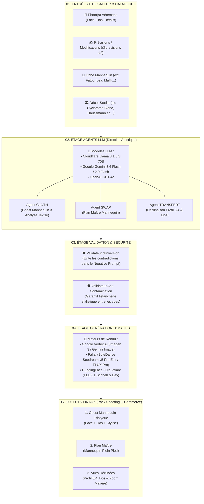

# Architecture du Studio FashionAI

Ce document décrit le fonctionnement complet du pipeline de génération du **Studio FashionAI**, les modèles d'intelligence artificielle utilisés, ainsi que les entrées et sorties attendues à chaque étape.

---

## 🗺️ Schéma Global du Pipeline

---

## 📋 Tableau Récapitulatif par Étape

| Étape | Rôle & Action | Modèles / Technologies | Données d'Entrée | Output Attendu |
| :--- | :--- | :--- | :--- | :--- |
| **01. Ingestion & Configuration** | Récupération des assets et envoi au backend. | Next.js API (`/api/shoots`) | • Photos du vêtement (Upload) • Fiche Mannequin (`character_sheet.png`) • Image du Décor (`reference.png`) | Requête POST contenant les images et les métadonnées vers l'orchestrateur. |
| **02. Direction Artistique (LLM)** | Analyse textile fine, découpe des pièces, respect de la morphologie et construction du prompt studio. Exécuté de manière séquentielle côté serveur. | **Llama 3.1/3.3 70B** (Cloudflare) ou **Gemini** / **GPT-4o** | • Description vêtement • Caractéristiques mannequin (teint, taille, coupe) • Spécifications lumière & angle | **Prompt d'image ultra-détaillé** (structure triptyque, éclairage studio, composition de matière, hex exacts). |
| **03. Contrôle & Validation** | Vérification automatique des prompts dans le pipeline serveur avant génération. | Fonctions Typescript de validation (`validators.ts`) | Prompt brut issu de l'étape 02 | • **Prompt assaini** sans termes interdits. • **Negative prompt ciblé** sans conflit d'inversion. |
| **04. Rendu Photographique** | Synthèse de l'image haute fidélité conservant l'intégrité du vêtement et du mannequin. | • **Fal.ai Seedream v5 Pro** • **Google Vertex AI** • **FLUX.1** | Prompt validé + Images de référence (vêtement + mannequin + décor) | Fichiers images haute résolution (PNG / WebP) au ratio choisi (`2:3`, `1:1`, `16:9`). |
| **05. Pack Final E-Commerce** | Stream (SSE) et assemblage progressif des vues. | Interface Studio & Téléchargement | Rendu d'image de l'étape 04 | **Pack E-Commerce complet** : 1. Vue Ghost Mannequin 2. Vue portée Face (Maître) 3. Vues déclinaisons (Profil / Dos / Zoom) |

---

## 🔬 Description Détaillée des Étapes

### Étape 01 — Entrées & Ingestion des Assets
L'utilisateur configure sa séance de shooting virtuel :
1. **Upload Vêtement** : 1 à 4 photos (face, dos, détails, zoom matière).
2. **Précisions / Modifs (`@precisions #2`)** : Matière réelle, longueur, type de fermeture, ajustement de coupe.
3. **Sélection Mannequin** : Choix dans le catalogue (Fatou, Léa, Malik, etc.) injectant une fiche de référence morphologique et stylistique (`character_sheet.png`).
4. **Sélection Décor** : Choix du studio (Cyclorama Blanc, Haussmannien, Streetwear Paris, etc.) injectant la référence de lumière et d'arrière-plan (`reference.png`).

---

### Étape 02 — Étage des Agents LLM (Direction Artistique)
Les agents spécialisés transforment les données en descriptions photographiques professionnelles :

* **Agent `cloth` (Ghost Mannequin)** : Décompose le vêtement en triptyque (Panneau 1 : mannequin stylisé noir, Panneau 2 : ghost face, Panneau 3 : ghost dos).
* **Agent `swap` (Plan Maître)** : Fusionne le mannequin du catalogue avec le vêtement sur le décor choisi pour le shooting principal.
* **Agents `transfert_profil` & `transfert_dos`** : Déclinent la pose du Plan Maître sous d'autres angles (3/4 profil et dos) en conservant une stricte cohérence vestimentaire.

**Modèles supportés :**
- `cloudflare` : Meta Llama 3.1 / 3.3 70B Instruct (Cloudflare Workers AI)
- `gemini` : Google Gemini 3.6 Flash / 2.0 Flash (Google AI Studio)
- `openai` : GPT-4o

---

### Étape 03 — Validation & Sécurité Anti-Contamination
Avant d'envoyer le prompt aux générateurs d'images, des validateurs automatisés s'exécutent :
- **Validateur d'Inversion** : S'assure qu'un mot-clé descriptif du vêtement (ex: `silk`, `buttons`, `red`) ne se retrouve pas accidentellement dans le *Negative Prompt*.
- **Validateur Anti-Contamination** : Empêche la fuite de détails d'une vue (ex: accessoires du dos) sur une vue incompatible.

---

### Étape 04 — Moteur de Génération d'Images
Le prompt validé et les images de référence sont soumis au moteur d'image sélectionné :
- **Fal.ai (ByteDance Seedream v5 Pro Edit)** : Édition et préservation fidèle du vêtement par conditionnement multimodal.
- **Google Vertex AI / Gemini Native Image** : Rendu studio haute résolution et respect photoréaliste des matières.
- **FLUX.1 (Schnell / Dev)** : Synthèse ultra-rapide et textures détaillées.

---

### Étape 05 — Livraison du Pack E-Commerce
L'utilisateur récupère le pack de visuels cohérents prêt pour son catalogue en ligne :
- Vue Packshot Ghost Mannequin (Face + Dos)
- Vue Portée Face (Lookbook & Fiche produit)
- Vues Déclinées (Profil, Dos, Zoom texture)
